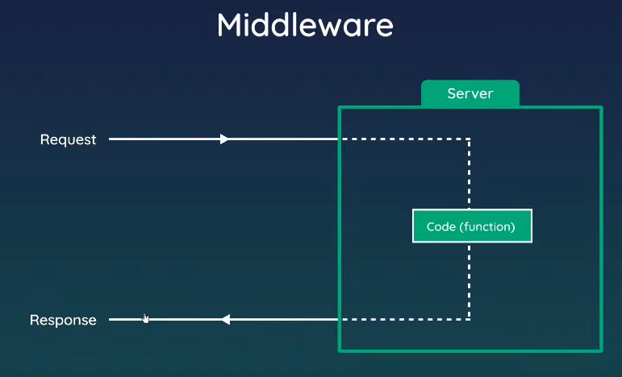

## Middleware

Code wich runs (on the server) between getting a request and sending a response

### Examples

- Logger middleware to log details of every request
- Authentitacion check middleware for protected routes
- Middleware to parse JSON data from request
- Return 404 pages

